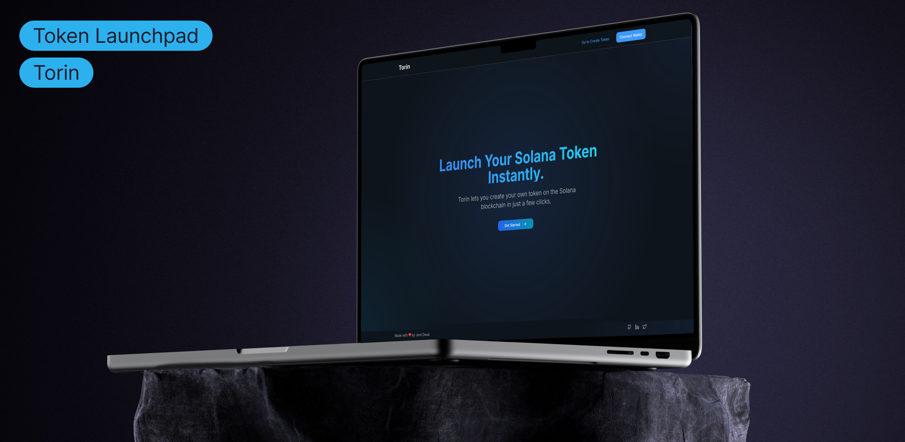
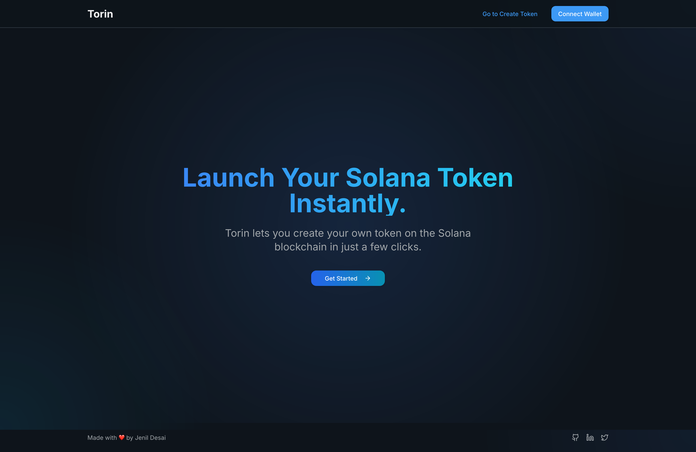
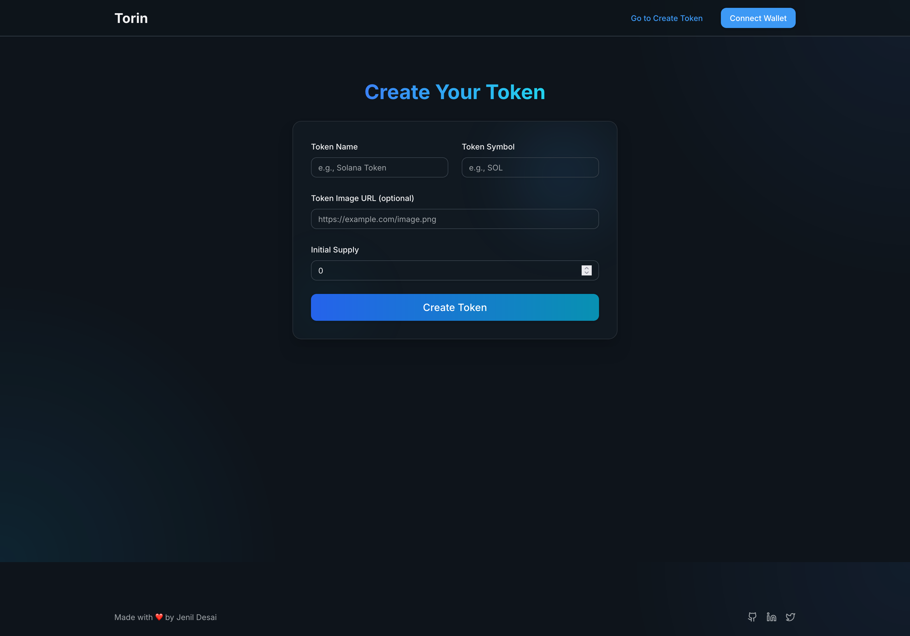

# 🚀 Torin – Solana Token Launchpad,Simplified

**Torin** is a lightweight and secure token launchpad built on the Solana blockchain. Designed for developers, startups, and Web3 enthusiasts, Torin makes it easy to launch SPL tokens on devnet or mainnet in just a few clicks — no CLI or in-depth blockchain knowledge required.

> Whether you're launching test tokens for dApps or building your community’s first coin, Torin has you covered.

---

## 📑 Table of Contents

1. [Overview](#-overview)
2. [Tech Stack](#-tech-stack)
3. [Packages & Libraries](#-packages--libraries)
4. [Getting Started](#-getting-started)
5. [Setup](#-setup)
6. [Features](#-features)
7. [Demo & Screenshots](#-demo--screenshots)
8. [Acknowledgments](#-acknowledgments)
9. [License](#-license)

---

## 🌟 Overview

Torin simplifies the token creation process on Solana by offering a secure, form-driven UI for defining token parameters and launching them directly to the blockchain. Built with a developer-first approach, it eliminates manual scripting and provides a seamless interface to interact with Solana’s token program.

---

## 🧠 Tech Stack

| Layer        | Tech                             |
|--------------|----------------------------------|
| Framework    | Next.js (TypeScript)             |
| Styling      | Tailwind CSS                     |
| Runtime      | Bun.js                           |
| Blockchain   | Solana + SPL Token Program       |

---

## 📦 Packages & Libraries

- `@solana/web3.js` – Solana JavaScript API
- `@solana/spl-token` – SPL token creation and management
- `@solana/wallet-adapter` (base, react, react-ui, wallets)
- `react-hook-form` – Form state management
- `@hookform/resolvers` – Zod integration for validation
- `zod` – Schema validation
- `sonner` – Toast/notification handling

---

## 🚀 Getting Started

> Prerequisites:
- Bun.js (or Node.js)
- Git
- IDE (WebStorm / VS Code / Zed)

---

## ⚙️ Setup

1. Clone the repository:
   ```bash
   git clone https://github.com/Jenil-Desai/Torin.git
   ```

2. Navigate to the project folder:

   ```bash
   cd torin
   ```

3. Open in your IDE and install dependencies:

   ```bash
   bun install   # or npm/yarn/pnpm
   ```

4. Run the development server:

   ```bash
   bun dev
   ```

---

## 🎯 Features

* 🔐 **Connect Wallets**

  * Secure connection with popular wallets using Solana Wallet Adapter

* 🧾 **Token Configuration**

  * Form UI to fill token name, symbol, decimals, and supply

* 🪙 **Launch Token**

  * Instantly deploy tokens to Solana devnet or mainnet (configurable)

---

## 📸 Demo & Screenshots

- [Live Demo](https://torin-psi.vercel.app)

|Mockup|Landing Page |Create Token Page|
|------|-------------|-----------------|
||||

---

## 🙏 Acknowledgments

1. **Harkirat Singh** – Web3 Cohort-3 Assignment Inspiration
2. [Solana Wallet Adapter Docs](https://github.com/solana-labs/wallet-adapter)

---

## 📜 License

This project is licensed under the **MIT License**.

---

> Torin – Launch your token. Build your ecosystem.
